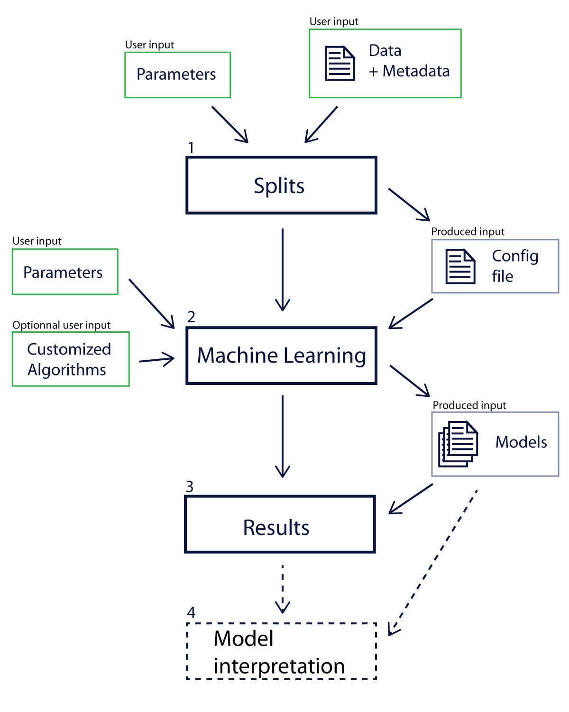

# Index

1. [Installation](#1-installation)  
    <ol type="A">
      <li>Python installation</li>
      <li>Git installation</li>
      <li>Launcher</li>
    </ol>
2. [Utilization](#2-utilization)  
    <ol type="A">
      <li><a href="#a-set-the-metadata-and-data">Set the metadata and data</a></li>
      <li><a href="#b-split-parameters">Split parameters</a></li>
      <ol>
        <li><a href="#1-define-experimental-designs">Define Experimental designs</a></li>
        <li><a href="#2-data-fusion">Data fusion</a></li>
        <li><a href="#3-define-split">Define split</a></li>
        <li><a href="#4-other-preprocessing">Other preprocessing</a></li>
        <li><a href="#5-generate-file">Generate file</a></li>
      </ol>
      <li><a href="#c-machine-learning-parameters">Machine Learning parameters</a></li>
      <li><a href="#d-look-at-the-results-for-each-algorithms">Look at the results for each algorithms</a></li>
      <li><a href="#e-compare-algorithms-results">Compare algorithms results</a></li>
      <li><a href="#f-restore-previous-experiment">Restore previous experiment</a></li>
    </ol>
3. [Implementation](#3-implementation)  
    <ol type="A">
      <li>Architecture</li>
      <li>Controller interface</li>
    </ol>
  

# 1. Installation

DONE BY VINCE

# 2. Utilization
> [Go back to index](#index)

Welcome into the MetaboDashboard!

The following sections will resume how to run a experiment and explore each parameters you can set.

The image in Home tab give a great insight of how the pipeline works.



*Pipeline explanation schema in Home tab*

## A. Set the metadata and data
> [Go back to index](#index)

Go to the Splits tab.


*Tab list with the Splits tab opened*

The following instructions are for the ```A) FILES``` section.

If you use Progenesis abundance file, you can choose to use the raw data (instead of the normalized)

To upload the data, drag and drop your data file in the ```DATA FILE(S)``` section 


*```DATA FILE(S)``` section*

You can also clic on the ```UPLOAD FILE``` button and choose the right file.

**You can repeat the operation for the metadata in the ```METADATA FILE``` section.**


*```MEATADATA FILE``` section*

## B. Split parameters
> [Go back to index](#index)

### 1. Define Experimental designs
> [Go back to index](#index)

The following instructions are for the ```B) DEFINE EXPERIMENTAL DESIGNS``` section.

With the board, you can run multiple experimental design, under certain conditions. Theses conditions are:
- use the same split parameters
- use the same Machine Learning (ML) algorithms
- use the same ML parameters

First of all, you need to select the target column. To clarify,  the target column contains the values that the algorithms will try to predict. A typical exemple is the column that contain the diagnosis.

The columns name prompted in the following figure are the column in the metadata file previously uploaded. If there are not the ones expected, please retry uploading the metadata in [this section](index.md#a-set-the-metadata-and-data)


*Targets column selection panel*

After setting the target column, we need to set the samples column. This column have to contains **unique IDs** for each samples.


*Samples column selection panel*

The main of the experimental designs configuration section is divided in two panel, respectively the *repository* and the *configuration* panel

Once the target column are defined, the possible labels are updated in the *configuration* panel as shown in the following figure.


*Updated possible labels in the* configuration *panel*

To build a binary design, you need to define the classes, in other words, to choose what you want to be opposed. An exemple using the previous values could be the identification of the sick person, opposing persons tagged with "Sickness A" and "Sickness B" and persons tagged "Control".

Add the experimental design by clicking on the ```ADD``` button.


*Example of a experimental design*

Note that you need to set a name, a label, for each class. Also, you need to set at least one possible target per class but you don't need to assigned all possible targets.

Once the designs are created, they will appear in the *repository* panel.


Repository *panel with two experimental design*

The ```RESET``` button will delete all the designs.

### 2. Data fusion
> [Go back to index](#index)

> **Warning**
> Not implemented yet


```Pos and Neg pairing``` allows to prevent the separation of positive and negative ionization and prevent the ML algorithms to learn the link between positive and negative ionization.

You can also use any other pattern for pairing with ```Other pairing```.

### 3. Define split
> [Go back to index](#index)

The following instructions are for the ```D) DEFINE SPLITS``` section.


*```DEFINE SPLITS``` splits section*

If you don't feel confortable with theses parameters, the minimum you need to know is:
- the proportion is quite standard, it will suit most of the time
- 5 splits is quick to run but some samples may never be used to test the algorithms. If you want a complete run, 25 splits should be enough.

In the case you want to tune it by hand, the probability that a sample is never in the test set follow a <a href="https://en.wikipedia.org/wiki/Markov_chain" target="_blank">Markov chain</a> with:
- $V_1=\begin{pmatrix} 
        0 & 1 & 0 & 0 & 0
     \end{pmatrix}$
- $P(s_{t+1}=j|s_t=i)=\frac{\begin{pmatrix} m-i \\ j-i \end{pmatrix}\begin{pmatrix} i \\ k-(j-i) \end{pmatrix}}{\begin{pmatrix} m \\ k \end{pmatrix}}$ with $s_t$ a state at a $t$ moment, $m$ the total number of samples and $k$ the number of samples in the test set (test proportion$\times m$).
- $M$ the $5\times 5$ matrix of $P(s_{t+1}=j|s_t=i)$
- $V_n=V_1\times M^{n-1}$ with $n$ the number of splits
- $P(X \gt 1) = 1-V_n[5]$ where $X$ is a random variable that model the number of samples that are never in the test set

The figure hereunder show $P(X \gt 1)$ (valeurs) as a function of the number of splits $n$ (1:nbr_limit) with $m=250$ samples and a test proportion of $0.2$ ($k=50$)


*$P(X \gt 1)$ (valeurs) as a function of the number of splits $n$ (1:nbr_limit) with $m=250$ samples and a test proportion of $0.2$ ($k=50$)*

### 4. Other preprocessing
> [Go back to index](#index)

> **Warning**
> Not implemented yet

This section is for LDTD support.

You can show all the processing parameter by clicking on the ```OPEN``` button.


### 5. Generate file
> [Go back to index](#index)

These finals instructions are for the ```F) GENERATE FILE``` section.

Once all the parameter, the samples id and target column, and **at least one** experimental design are set, you can run the splits computation by clicking on the ```CREATE``` button.


*```GENERATE FILE``` section*

## C. Machine Learning parameters
> [Go back to index](#index)

### 1. Define learning configurations
> [Go back to index](#index)

 - CV search type  

 - Number of croos validation folds  

 - Number of processes  

### 2. Define learning algorithms
> [Go back to index](#index)

 - You have to choose the algorithms you want to use in the list of available algorithms.
 - Add sklearn algorithms

## D. Look at the results for each algorithms
> [Go back to index](#index)

## E. Compare algorithms results
> [Go back to index](#index)

## F. Restore previous experiment
> [Go back to index](#index)

# 3. Implementation
> [Go back to index](#index)

## A. Architecture
> [Go back to index](#index)

The Methabodashboards software is organize in three main package.
 - The Domain package :  
 It contains all the logic that compose the Metabodashboard.  
 This package can access freely the Service package.  
 All of the communication with the UI package must pass by the controller. This allows us to modify the Domain if necessary without having to modify the UI too.
 - The UI package :  
 It contains all the classes that are used to display the web interface of the Metabodashboard.  
 It manages only the interface and connects to the Domain by the controller only.
 - The Service package :  
 It can be access by both other packages and contains methods that are frequently used in different classes.

Here is a diagram that represents the communications between all three packages. 


This diagram shows all the classes that compose the Domain package of the Methabodashboard and the interaction between them.


This diagram shows all the classes that compose the UI package of the Methabodashboard and the interaction between them.


## B. Controller interface
> [Go back to index](#index)

This section can be use as a high level documentation of the MetaboController.py file that serves of controller in the Metabodashboard.

```Python
  set_metadata(filename: str, data=None, from_base64=True)
```
This function 


```Python
  set_data_matrix_from_path(path_data_matrix, data=None, use_raw=False, from_base64=True)
```

```Python
  set_id_column(id_column: str)
```

```Python
  set_target_column(target_column: str)
```

```Python
  add_experimental_design(classes_design: dict)
```

```Python
  set_train_test_proportion(train_test_proportion: float)
```

```Python
  set_number_of_splits(number_of_splits: int)
```

```Python
  create_splits()
```

```Python
  set_selected_models(selected_models: list)
```

```Python
  learn(folds: int)
```

```Python
  get_all_results()
```


