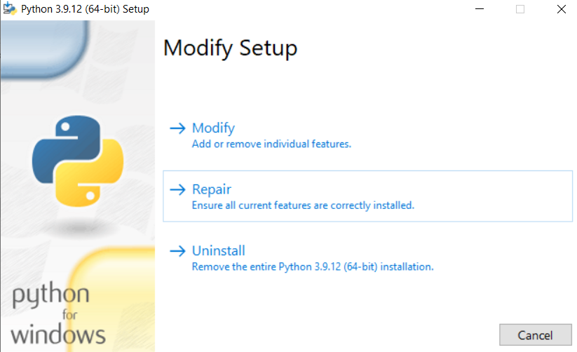

<html lang="en">
<head>
    <meta charset="UTF-8">
    <title>Title</title>
    <link href="stylesheet.css" rel="stylesheet">

</head>
<body>

<!-- CSS only -->
<link rel="preconnect" href="https://fonts.googleapis.com">
<link rel="preconnect" href="https://fonts.gstatic.com" crossorigin>
<link href="https://fonts.googleapis.com/css2?family=Playball&display=swap" rel="stylesheet"> 
<link href="https://cdn.jsdelivr.net/npm/bootstrap@5.2.0-beta1/dist/css/bootstrap.min.css" rel="stylesheet"
      integrity="sha384-0evHe/X+R7YkIZDRvuzKMRqM+OrBnVFBL6DOitfPri4tjfHxaWutUpFmBp4vmVor"
      crossorigin="anonymous">

<ul class="nav nav-tabs">
    <li class="nav-item">
        <a class="nav-link active" data-bs-toggle="tab" href="#Installation">Installation</a>
    </li>
    <li class="nav-item">
        <a class="nav-link" data-bs-toggle="tab" href="#Home">Home</a>
    </li>
    <li class="nav-item">
        <a class="nav-link" data-bs-toggle="tab" href="#Splits">Splits</a>
    </li>
    <li class="nav-item">
        <a class="nav-link" data-bs-toggle="tab" href="#MachineLearning">Machine Learning</a>
    </li>
    <li class="nav-item">
        <a class="nav-link" data-bs-toggle="tab" href="#Results">Results</a>
    </li>
    <li class="nav-item">
        <a class="nav-link" data-bs-toggle="tab" href="#ResultsAggregated">Results Aggregated</a>
    </li>
    <li class="nav-item">
        <a class="nav-link" data-bs-toggle="tab" href="#Implementation">Implementation</a>
    </li>
</ul>

<!------------ Installation tab ------------>
<!------------------------------------------------------------------------------------------------------>
    

         <h2 id="Prerequisites">Prerequisites</h2>
        The first step, to use MeDIC, is to install Python and Git. You also need to make sure that Microsoft
        Visual C++ is correctly installed if you're using Windows.
        Note that we only support Windows and Linux for now and only Python 3.8, 3.9 and 3.10  
        

            

                <h2 class="accordion-header" id="heading_python_installation">
                    <button class="accordion-button collapsed" type="button" data-bs-toggle="collapse"
                            data-bs-target="#collapse_python_installation" aria-expanded="true"
                            aria-controls="collapse_python_installation">
                        Python installation
                    </button>
                </h2>
                

                    

                        
In order to install Python, you need to go to this <a
                                href="https://www.python.org/downloads/" target="_blank"
                                rel="noreferrer noopener">link</a>
                            and select your operating system.

                        

                            <h2 class="accordion-header" id="heading_python_installation_for_windows">
                                <button class="accordion-button collapsed" type="button" data-bs-toggle="collapse"
                                        data-bs-target="#collapse_python_installation_for_windows" aria-expanded="true"
                                        aria-controls="collapse_python_installation_for_windows">
                                    For Windows
                                </button>
                            </h2>
                            

                                

                                    
You can download the latest version or a previous one if you prefer (Note : MeDIC
                                        supports python 3.10, 3.9 and 3.8).
                                        You just have to double-click and follow the installation instructions.
                                        You can also follow this <a
                                                href="https://phoenixnap.com/kb/how-to-install-python-3-windows"
                                                target="_blank" rel="noreferrer noopener">tutorial</a> for further
                                        details.

                                    
WARNING : Don't forget the select Add Python 3.X to PATH on the first page ! 

                                    
                                    
NOTE : To verify that Python is inb the PATH, you can open a new terminal, type
                                        Python and enter. If you get
                                        something like this, it's all good. 
                                        Otherwise, you have to double-click again on the python.exe file you downloaded
                                        at the beginning
                                        and click repair. Then click on Next. Then you can click on add to path and
                                        install.
                                    
  
                                

                            

                        

                        

                            <h2 class="accordion-header" id="heading_python_installation_for_linux">
                                <button class="accordion-button collapsed" type="button" data-bs-toggle="collapse"
                                        data-bs-target="#collapse_python_installation_for_linux" aria-expanded="true"
                                        aria-controls="collapse_python_installation_for_linux">
                                    For Linux
                                </button>
                            </h2>
                            

                                

                                    
You can select the latest Python source release for python3 or a stable release
                                        for 3.8 to 3.10.
                                        You can also follow this <a
                                                href="https://www.scaler.com/topics/python/install-python-on-linux/"
                                                target="_blank" rel="noreferrer noopener">tutorial</a> for further
                                        details

                                

                            

                        

                    

                

            

            

                <h2 class="accordion-header" id="heading_git_installation">
                    <button class="accordion-button collapsed" type="button" data-bs-toggle="collapse"
                            data-bs-target="#collapse_git_installation" aria-expanded="true"
                            aria-controls="collapse_git_installation">
                        Git installation
                    </button>
                </h2>
                

                    

                        In order to install Git, you need to go to this <a href="https://git-scm.com/downloads"
                                                                           target="_blank" rel="noreferrer noopener">link</a>
                        and select your operating system. 
                        

                            <h2 class="accordion-header" id="heading_git_installation_for_windows">
                                <button class="accordion-button collapsed" type="button" data-bs-toggle="collapse"
                                        data-bs-target="#collapse_git_installation_for_windows" aria-expanded="true"
                                        aria-controls="collapse_git_installation_for_windows">
                                    For Windows
                                </button>
                            </h2>
                            

                                

                                    
You can then choose the Standalone Installer (most computers now use the 64 bits).
                                        After downloading the .exe file, double-click on it and follow the installation
                                        instructions.

                                    
Note : You'll have a lot of choices, leave them as default if you are not
                                        familiar.

                                

                            

                        

                        

                            <h2 class="accordion-header" id="heading_git_installation_for_linux">
                                <button class="accordion-button collapsed" type="button" data-bs-toggle="collapse"
                                        data-bs-target="#collapse_git_installation_for_linux" aria-expanded="true"
                                        aria-controls="collapse_git_installation_for_linux">
                                    For Linux
                                </button>
                            </h2>
                            

                                

                                    Open a terminal and run the command :
                                    <code>
                                        sudo apt-get install git
                                    </code>
                                    Enter your root password and follow the installation instructions.
                                    For more details follows this <a href="https://git-scm.com/download/linux"
                                                                     target="_blank" rel="noreferrer noopener">link</a>.
                                

                            

                        

                    

                

            

            

                <h2 class="accordion-header" id="heading_cpp_installation">
                    <button class="accordion-button collapsed" type="button" data-bs-toggle="collapse"
                            data-bs-target="#collapse_cpp_installation" aria-expanded="true"
                            aria-controls="collapse_cpp_installation">
                        Microsoft Visual C++ requirement
                    </button>
                </h2>
                

                    

                        To make sure MeDIC and all it's dependencies works properly you need Microsoft Visual C++ 14.0
                        or later.
                        To check if the correct version of Microsoft Visual C++ is installed or your computer you can
                        open the Control Panel
                        from the start menu, click on "uninstall app" and scroll down to see which version, if any, of
                        Microsoft Visual C++ is installed.
                        

                            <h2 class="accordion-header" id="heading_cpp_installation_for_windows">
                                <button class="accordion-button collapsed" type="button" data-bs-toggle="collapse"
                                        data-bs-target="#collapse_cpp_installation_for_windows" aria-expanded="true"
                                        aria-controls="collapse_cpp_installation_for_windows">
                                    Install new version
                                </button>
                            </h2>
                            

                                

                                    
In order to install Microsoft Visual C++, you need to go to this
                                        <a href="https://visualstudio.microsoft.com/visual-cpp-build-tools/"
                                           target="_blank" rel="noreferrer noopener">link</a> and select Visual Studio
                                        2022 Community.

                                    
Select "Desktop development in C++" and go to the "Individual components" tab and
                                        scroll down to
                                        select "C++ V14.32(17.2) MFC for Build Tools v143 (x86 & x64)" or later and
                                        click install (It may take a while depending on your internet download
                                        speed).

                                

                            

                        

                    

                

            

        

 

  A launcher has been made for MeDIC to facilitate the installation process. This launcher can be used for the
  installation and to start MeDIC. 
  The launcher file needs Git and Python to be able to do all the installation steps for you.

<h2 id></h2>
<h4 id="a-normal-installation">A. Normal installation</h4>
<ul>
<li>Download launcher.py on
  our <a href="https://github.com/ElinaFF/MetaboDashboard" target="_blank" rel="noreferrer noopener">github</a>
</li>
<li>Open a terminal (*cmd* in Windows)</li>
<li>Run the launcher on your computer with the command : <a href="#note1">*</a><code>python launcher.py</code>
</li>
</ul>
 
<small id="note1" class="form-text text-muted">
    * No need to clone the repository, we will install everything we need.
    If you still want to do so and don’t want the launcher to redownload it during the installation process,
    make sure to
    clone the repository in the same folder as the launcher.  MeDIC uses conda for his environment,
    if you don’t have any Conda instance installed on your machine, the launcher will install one (Miniconda3).
      All the dependencies necessary will be installed in the conda environment.
</small>

<h4 id="b-clone-repository-and-normal-installation">B. Clone repository and normal installation</h4>
<ul>
    <li>Open a terminal (<em>cmd</em> in Windows)</li>
    <li>Clone the Github repository.
        <pre><code> git clone https://github.com/ElinaFF/MetaboDashboard
</code></pre>
            </li>
            <li>Move inside the repository
                <pre><code>cd MetaboDashboard
</code></pre>
            </li>
            <li>Run the launcher
                <pre><code>python launcher.py
</code></pre>
            </li>
        </ul>

<h4 id="c-manual-installation">C. Manual installation</h4>
        <ul>
            <li>Install Miniconda following the <a
                    href="https://docs.conda.io/en/latest/miniconda.html">documentation</a></li>
            <li>Open a terminal (<strong>&quot;cmd&quot; in Windows not &quot;Powershell&quot;</strong>)</li>
            <li>Create an environment with Conda:
                <pre><code>conda create medic
</code></pre>
            </li>
            <li>Enter in the environment
                <pre><code>conda activate medic
</code></pre>
                

                If the command worked, you should see the name &quot;medic&quot; written at the beginning of your
                prompt

            </li>
        </ul>

<ul>
    <li>Clone the Github repository and move inside.
        <pre><code>  git clone https://github.com/ElinaFF/MeDIC
  cd MeDIC
</code></pre>
                <ul>
                    <li>Install the dependencies:
                        <pre><code>python -m pip install -r requirements.txt
</code></pre>
                        
If you have an error for ParmEd, pyscm or randomscm, it may be a C++ compilation problem
                        (<a href="https://answers.microsoft.com/en-us/windows/forum/all/microsoft-visual-c-140/6f0726e2-6c32-4719-9fe5-aa68b5ad8e6d">see
                            here</a>)
                        return <a href="#heading_cpp_installation">here</a> to install, or update, Microsoft Visual C++.

                    </li>
                    <li>Launch the Web interface
                        <pre><code>python main.py
</code></pre>
                    </li>
                </ul>
            </li>
        </ul>
<h4 id="d-installation-on-wsl-windows-subsystem-for-linux-">D. Installation on WSL (Windows Subsystem for
            Linux)</h4>
        
During the normal installation, you may have a problem with the Path variable. We haven&#39;t found a
            solution yet.
            You may need to go through the <a href="#c-manual-installation">Manual installation</a>.

<h2 id="medic-launcher-options">MeDIC launcher options</h2>
        
Those commands are optionals but allow more flexibility. They can be combined
            or used independently.

<h4 id="1-use-an-environment-you-already-have">1. Existing environment</h4>
        <ul>
            <li>The packages of MeDIC environment can be installed elsewhere, if you don&#39;t want to
                create a new one,
                with the command : <a href="#note2">**</a>
                <pre><code> python launcher.py --environment &lt;environment_name&gt;
 python launcher.py -e&lt;environment_name&gt;
</code></pre>
                
 ** It is recommended not to create MeDIC environment into another environment as it may
                    cause problems.

    </li>

</ul>
<h4 id="2-fast-launch-for-everyday-use">2. Fast launch for everyday use</h4>
<ul>
    <li>MeDIC can be launched faster without any verifications of the environment with the command :
        <pre><code> python launcher.py --no-check
 python launcher.py -c
</code></pre>
            </li>
        </ul>
        <h4 id="3-installing-medic-for-later-use">3. Installing MeDIC for later use</h4>
        <ul>
            <li>MeDIC can be installed without launching it at the end with the command :
                <pre><code>python launcher.py --no-launch
python launcher.py -l
</code></pre>
            </li>
        </ul>
        <h4 id="4-update-medic-to-the-latest-version">4. Update MeDIC to the latest version</h4>
        <ul>
            <li>MeDIC can be updated with the command :
                <pre><code>python launcher.py --update
python launcher.py -u
</code></pre>
                Note: This will verify the environment and download packages if necessary, it also won&#39;t start
                MeDIC.
            </li>
        </ul>
    

<!------------ Home tab ------------>
<!------------------------------------------------------------------------------------------------------>
    

        <h2 id="saving-file">Saving file</h2>
        
Before explaining the interface, lets see how the experiments are saved and how you can share them.
            To allow a better modularity of the experiments, the three major steps of MeDIC are saved independently into
            a file after each step.
            Moreover, the data and metadata are only saved in local repository, not in the saving file, which allow the
            sharing of
            the file to outside collaborators.
            To continue an experiments and/or visualize its results, MeDIC offers the possibility to load a saving file
            in the first tab (Home).
            However, to prevent any problem between a local data saving and a potential different saving file, a hashing
            process
            takes place to compare the file being loaded and the local dumps of data. 

        
Welcome into MeDIC!

        
The following sections will resume how to run an experiment and explore each parameter you can set.

        <blockquote>
            
The image in Home tab give a great insight of how the pipeline works.

            

        </blockquote>
        
<em>Pipeline explanation schema in Home tab</em>

        <h2 id="a-set-the-metadata-and-data">A. Set the metadata and data</h2>
        
Go to the Splits tab.

        <blockquote>
            

        </blockquote>
        
<em>Tab list with the Splits tab opened</em>

        
The following instructions are for the <code>A) FILES</code> section.

        
If you use Progenesis abundance file, you can choose to use the raw data (instead of the normalized).

        
To upload the data, drag and drop your data file in the <code>DATA FILE(S)</code> section.

        <blockquote>
            

            
<em><code>DATA FILE(S)</code> section</em>

        </blockquote>
        
You can also click on the <code>UPLOAD FILE</code> button and choose the right file.

        
<strong>You can repeat the operation for the metadata in the <code>METADATA FILE</code> section.</strong>

        <blockquote>
            

            
<em><code>MEATADATA FILE</code> section</em>

        </blockquote>
        
The supported files are excel, odt or csv.

        
If the error &quot;Rows must have an equal number of columns&quot; occurred,
            it means that
            some lines don&#39;t have cells for all columns.

<h3 id="1-define-experimental-designs">1. Define Experimental designs</h3>

The following instructions are for the <code>B) DEFINE EXPERIMENTAL DESIGNS</code> section.

With the board, you can run multiple experimental design, under certain conditions. These conditions are:

<ul>
<li>use the same split parameters</li>
<li>use the same Machine Learning (ML) algorithms</li>
<li>use the same ML parameters</li>
</ul>

First, you need to select the target column. To clarify, the target column contains the values that the
algorithms
will try to predict. A typical example is the column that contain the diagnosis.

The columns name prompted in the following figure are the column in the metadata file previously uploaded. If
there
are not the ones expected, please retry uploading the metadata in the section A. Set the metadata and data in the <a
        href="#Home">Home tab</a>

<blockquote>

<em>Targets column selection panel</em>

</blockquote>

After setting the target column, we need to set the samples&#39; column. This column has to contain <strong>unique
IDs</strong> for each sample.

<blockquote>

<em>Samples column selection panel</em>

</blockquote>

The main part of the experimental designs configuration section is divided in two panel, respectively the
<em>repository</em>
and the <em>configuration</em> panel

Once the target columns are defined, the possible labels are updated in the <em>configuration</em> panel as
shown in the
following figure.

<blockquote>

<em>Updated possible labels in the</em> configuration <em>panel</em>

</blockquote>

To build a binary design, you need to define the classes, in other words, to choose what you want to be
opposed.
An example using the previous values could be the identification of the sick person, opposing persons tagged
with
&quot;Sickness A&quot; and &quot;Sickness B&quot; and persons tagged &quot;Control&quot;.

Add the experimental design by clicking on the <code>ADD</code> button.

<blockquote>

<em>Example of a experimental design</em>

</blockquote>

Note that you need to set a name, a label, for each class. Also, you need to set at least one possible target
per
class, but you don&#39;t need to assign all possible targets.

Once the designs are created, they will appear in the <em>repository</em> panel.

<blockquote>

Repository <em>panel with two experimental design</em>

</blockquote>

The <code>RESET</code> button will delete all the designs.

<h3 id="2-data-fusion">2. Data fusion</h3>
<blockquote>

<strong>Warning</strong>
    Not implemented yet

</blockquote>

<code>Pos and Neg pairing</code> allows to prevent the separation of positive and negative ionization and
prevent the ML
algorithms to learn the link between positive and negative ionization.

You can also use any other pattern for pairing with <code>Other pairing</code>.

<h3 id="3-define-split">3. Define split</h3>

The following instructions are for the <code>D) DEFINE SPLITS</code> section.

<blockquote>

<em><code>DEFINE SPLITS</code> splits section</em>

</blockquote>

If you don&#39;t feel conformable with these parameters, the minimum you need to know is:

<ul>
<li>the proportion is quite standard, it will suit most of the time</li>
<li>5 splits is quick to run but some samples may never be used to test the algorithms. A more complete run
    will take 15 to 25 splits.
</li>
</ul>

In the other case, the splits are made by copying the dataset and applying a random separation with a
different
random seed at each time. This principle is called bootstrap.

Most of the time, medical data are fat data ,i.e. contains many features (characteristic) for few samples,
which can lead to many large when the training set is changed.

Moreover, as the cross validation (explained in further details in section 1. Define learning configurations in the <a
    href="#MachineLearning">Machine Learning tab</a>),
it allows the model(s) to be tested on most of the samples.

If you want to achieve it, the probability that all samples are seen in the test set, i.e. the
probability that a sample is never in the test set, follow a
<a href="https://en.wikipedia.org/wiki/Markov_chain" target="_blank" rel="noreferrer noopener">Markov
    chain</a>. With an
example of 5 samples with 80-20 train-test repartition, the chain is as follows:

<blockquote>

<em>P(X<1) (values) as a function of the number of splits n (1:nbr_limit)
    with m=250 samples and a test proportion of 0.2 (k=50)</em>

</blockquote>
<h3 id="4-other-preprocessing">4. Other preprocessing</h3>
<blockquote>

<strong>Warning</strong>
    Not implemented yet

</blockquote>

This section is for LDTD support.

You can show all the processing parameter by clicking on the <code>OPEN</code> button.

<h3 id="5-generate-file">5. Generate file</h3>

These finals instructions are for the <code>F) GENERATE FILE</code> section.

Once all the parameters, the samples id and target columns, and <strong>at least one</strong> experimental
design are set, you can
run the splits&#39; computation by clicking on the <code>CREATE</code> button.

<blockquote>

<em><code>GENERATE FILE</code> section</em>

</blockquote>

<h3 id="1-define-learning-configurations">1. Define learning configurations</h3>

The following instructions are for the <code>DEFINE LEARNING CONFIGS</code> section.

If you&#39;re not comfortable with these parameters, you can safely keep the default
values and jump to the <a href="#2-define-learning-algorithms">next section</a>.

First, before choosing a Cross Validation (CV) search type, you need to understand
the principle of CV.

The method consist in separating the dataset in n sections. At each iteration,
the first or the next section will be used as the test set and the other sections will
form the training set. It allows us to train <strong>and</strong> test the model on all the dataset.
Furthermore, the mean accuracy over the folds is a better measurement of the performance of the models.

The number of folds defines the number of time the model(s) will be trained, and the number
of division in the dataset.

We use CV in order to make sure the model doesn&#39;t overfit,
we keep a sample of the dataset to test it at the end. If the algorithm is overfitting,
it will make a lot of errors when presented a new set of data. This also allows us to
make sure the algorithm is tested on all samples.

For more details, see this <a href="https://learn.g2.com/cross-validation" target="_blank"
                                rel="noreferrer noopener">explanation</a>.

The ability of a search algorithm is to train a set of models with a set of parameters,
and compute a metric tested combination. This metric is most of the time the accuracy
(the number of correct predictions over the total number of predictions (the number of samples)).

After the computation, the algorithm is able to find the model combined with the parameters
that perform best, in the tested combinations.

The <code>GridSearchCV</code> is a search algorithm using CV that test every possible
combination of parameters, like in a grid. This method is effective but may take a long time
to run and may test useless combination.

The <code>RandomizedSearchCV</code> comes as a counterpoint and take random combinations of parameters. This
method allow
more values to be tested and runs faster but isn&#39;t as rigorous as the <code>GridSearchCV</code>. 

In the <code>SELECT CV SEARCH TYPE</code> panel, you can choose either <code>GridSearchCV</code> or <code>RandomizedSearchCV</code>.

You can set the number of folds in the <code>NUMBER OF CROSS VALIDATION FOLDS</code>.

The number of processes in the <code>Number of processes</code> field is the number of parallel job you want
to run. Two is enough
to increase the speed of computation. More processes might slow down to crash your PC.

<h3 id="2-define-learning-algorithms">2. Define learning algorithms</h3>

The following instructions are for the <code>DEFINE LEARNING ALGORITHMS</code> section.

The <code>AVAILABLE ALGORITHMS</code> are:

<ul>
<li>Decision Tree</li>
<li>Random Forest</li>
<li>SCM</li>
<li>Random SCM</li>
</ul>

The first classifier implement a regular <strong><em>decision tree</em></strong>. To make a prediction, the
data is the input of the root node.
The root node, as the others, has a threshold for one feature : for example $$\text{cholesterol} \geq 2$$.
If the value validate the threshold, it goes to the right node, otherwise it goes to the left, until it
reach a leaf.
The leaf assigns a class to the sample.

The second classifier, the <strong><em>random forest</em></strong>, is a decision tree (DT) ensemble that
classify independently the sample.
Each DT vote the class of the sample. The class that has the most vote is assign to the sample.

The <strong><em>Set Covering Machine (SCM)</em></strong> is a combination of rules. For example, if the
cholesterol is greater than 2 g/l OR insulin is
greater than 140 mg/dL AND insulin is less than 199 mg/dL.

The last classifier is the <strong><em>Random SCM</em></strong>. As the random forest is a voting decision
tree ensemble, the random SCM is a voting SCM ensemble.

You have to tick <strong>at least one</strong> algorithms. 

But because of their differences, some may perform better than others on different datasets.
It is advised to take at least one SCM-type and one DecisionTree-type algorithms.

If you want to add <a href="https://scikit-learn.org/stable/index.html">scikit-learn algorithms</a> that isn&#39;t
in the available algorithms, you can in the <code>ADD SKLEARN ALGORITHMS</code>.

You need to complete the import and specify the grid search parameter (for the CV search algorithm). 

  

    <h2 class="accordion-header" id="headingOne">
      <button class="accordion-button" type="button" data-bs-toggle="collapse" data-bs-target="#collapseOne" aria-expanded="true" aria-controls="collapseOne">
        Add a full custom algorithms (for expert)
      </button>
    </h2>
    

      

To add a full custom model, you need to add it to the configuration file located
at <code class="language-plaintext highlighter-rouge">metabodashboard/conf/SupportedModel.py</code>. 
Add a dictionary containing the <strong>NON-INSTANTIATED</strong> class and the param grid. Format is the following (
change only the attribute <em>xxx</em>)

<pre>
  <code class="language-python">
    &quot;_Printed<em>name</em>&quot;: {
          &quot;function&quot;: _non-instantiated<em>class</em>,
          &quot;ParamGrid&quot;: {
              &quot;<em>p1</em>&quot;: <em>[0.5, 1., 2.]</em>,
              &quot;<em>p2</em>&quot;: <em>[1, 2, 3, 4, 5]</em>,
              ...
          }
      },
  </code>
</pre>

  After adding your configuration, <strong>reboot</strong> MeDIC by stopping and restarting the launcher. 
  The algorithm should be in the <code class="language-plaintext highlighter-rouge">AVAILABLE
  ALGORITHMS</code> section
  with his printed name. 
  Note, the custom model are in the save file (.mtxp) and will be restored. 
      

    

  

    PCA(relation linéaires) umap(relation non lihnéaire)
    graphique accuracy (graphic pour chaque split), tableau de résultat (descr metrics comment les intèrbpéter)
    matrice de confusion (ce que ça veut dire) feature importance (tableau utilisation) strip chart 

  All graphs can be saved and will be saved by default in SVG format. This can be changed in the ResultAgregatedTab.py 
  file at the beginning of the file. 

  <ul class="nav nav-tabs">
      <li class="nav-item">
          <a class="nav-link active" data-bs-toggle="tab" href="#Data">Data</a>
      </li>
      <li class="nav-item">
          <a class="nav-link" data-bs-toggle="tab" href="#Algorithm">Algorithm</a>
      </li>
      <li class="nav-item">
          <a class="nav-link" data-bs-toggle="tab" href="#Features">Features</a>
      </li>
      <li class="nav-item">
          <a class="nav-link" data-bs-toggle="tab" href="#DT Tree">DT tree</a>
      </li>
  </ul>
  

      

          <h3>The PCA (Principal Component Analysis) graph</h3>
          <h3>the UMAP (Uniform Manifold Approximation and Projection) graph</h3>
      

      

          <h3>Accuracy plot</h3>
              

                  This graphs shows, throughout all the splits, the accuracy of the algorithm on the train set and
                  the test set. The blue line, representing the accuracy on the train set, and the red line,
                  representing tha accuracy on the test set should be as close as possible to 1. If the accuracy
                  of the algorithm on the test set is way lower than the accuracy on the train set, it means that
                  the algorithm may be overfitting. This can mean that the algorithm trained to much on the train
                  set or the train set is not representative of the entire data.
              

          <h3>Metrics table</h3>
          <h3>Split number</h3>
              

                  This value allows to select witch split's confusion matrix to show in the following section.
              

          <h3>Confusion matrix</h3>
              

                  This matrix represents the accuracy of the prediction of the algorithm on a specific split
                  compared with  to the reality.
                  The closer to one, on the good prediction diagonal, the better.
              

      

      

          <h3>Top 10 features sorted by importance</h3>
          <h3>Stripchart of features</h3>
      

      

          <h3></h3>
      

  

    
MeDIC software is organized in three main package.

    <ul>
        <li>The Domain package : It contains all the logic that compose MeDIC. This package can access freely
            the Service package. All the communication with the UI package must pass by the controller. This
            allows us to modify the Domain if necessary without having to modify the UI too.
        </li>
        <li>The User Interface (UI) package : It contains all the classes that are used to display the web
            interface of MeDIC. It manages only the interface and connects to the Domain by the controller only.
        </li>
        <li>The Service package : It can be accessed by both other packages and contains methods that are
            frequently used in different classes.
        </li>
    </ul>
    
Here is a diagram that represents the communications between all three packages. 

    <blockquote>
        

        
Package diagram

    </blockquote>
    
This diagram shows all the classes that compose the Domain package of MeDIC and the interaction between
        them.

    <blockquote>
        

        
Simplified class diagram of the Domain package

    </blockquote>
    
This diagram shows all the classes that compose the UI package of MeDIC and the interaction between them.

    <blockquote>
        

        
Simplified class diagram of the UI package

    </blockquote>
    <h2 id="b-controller-interface">B. Controller interface</h2>
    
This section can be use as a high-level documentation of the MetaboController class that serves of controller
        in MeDIC.

    
This class can be used to integrate MeDIC in a Python script.

    
The explanation of the concepts and the pipelines are in the <a href="#Home">Home tab</a>. 
Don&#39;t hesitate to go back to this section while reading this one.

    <pre><code class="lang-Python">  set_metadata(filename: str, data=None, from_base64=True)
</code></pre>

This function sets the metadata using the path specified in parameter. The from_base64 parameter must be set to false
if your file isn&#39;t encoded (csv, xlsx, ...).

<pre><code class="lang-Python">  set_data_matrix_from_path(path_data_matrix, data=None, use_raw=False, from_base64=True)
</code></pre>

This function sets the data matrix the same way as the metadata.

<pre><code class="lang-Python">  set_id_column(id_column: str)
</code></pre>

This function sets the name of the column containing the <strong>unique</strong> IDs.

<pre><code class="lang-Python">  set_target_column(target_column: str)
</code></pre>

This function sets the name of the column containing the targets.

<pre><code class="lang-Python">  add_experimental_design(classes_design: dict)
</code></pre>

This function adds an experimental design. The input dictionary must follow the format : 

<pre><code class="lang-Python">{
  "class1": ["target1", "target2"],
  "class2": ["target3"]
}
</code></pre>
<pre><code class="lang-Python">  set_train_test_proportion(train_test_proportion: float)
</code></pre>

This function sets the proportion of the data that will be used as tests after the training.

<pre><code class="lang-Python">  set_number_of_splits(number_of_splits: int)
</code></pre>

This function sets the number of splits as explain in the section 3. Define split in the <a href="#Splits">Split tab</a>

<pre><code class="lang-Python">  create_splits()
</code></pre>

Once all the splits are set, this function creates all the splits at the same time.

<pre><code class="lang-Python">  set_selected_models(selected_models: list)
</code></pre>

Set the list of models that will be trained.

<pre><code class="lang-Python">  learn(folds: int)</code></pre>

Start the training of all the models on all splits. Folds is used for the cross-validation process (explained
in <a href="#1-define-learning-configurations">Define learning configuration</a>)

<pre><code class="lang-Python">  get_all_results()
</code></pre>

Return all the data about the results, and the best model.

<h2 id="c-full-class-diagram">C. Full class diagram</h2>

</body>
</html>