# Index

<link rel="stylesheet" type="text/css" href="bootstrap.min.css">
<script src="https://cdn.jsdelivr.net/npm/bootstrap@5.2.0-beta1/dist/js/bootstrap.bundle.min.js" integrity="sha384-pprn3073KE6tl6bjs2QrFaJGz5/SUsLqktiwsUTF55Jfv3qYSDhgCecCxMW52nD2" crossorigin="anonymous"></script>

<style>
  summary{text-decoration: underline}

   details p{
      background-color: rgba(199, 199, 199, 0.3);
}
</style>

1. [Installation](#1-installation)  
    <ol type="A">
      <li><a href="#a-normal-installation">Normal installation</a></li>
      <li><a href="#b-clone-repository-and-normal-installation">Clone repository and normal installation</a></li>
      <li><a href="#c-manual-installation">Manual installation</a></li>
    </ol>
2. [Utilization](#2-utilization)  
    <ol type="A">
      <li><a href="#a-set-the-metadata-and-data">Set the metadata and data</a></li>
      <li><a href="#b-split-parameters">Split parameters</a></li>
      <ol>
        <li><a href="#1-define-experimental-designs">Define Experimental designs</a></li>
        <li><a href="#2-data-fusion">Data fusion</a></li>
        <li><a href="#3-define-split">Define split</a></li>
        <li><a href="#4-other-preprocessing">Other preprocessing</a></li>
        <li><a href="#5-generate-file">Generate file</a></li>
      </ol>
      <li><a href="#c-machine-learning-parameters">Machine Learning parameters</a></li>
      <ol>
        <li><a href="#1-define-learning-configurations">Define learning configurations</a></li>
        <li><a href="#2-define-learning-algorithms">Define learning algorithms</a></li>
      </ol>
      <li><a href="#d-look-at-the-results-for-each-algorithms">Look at the results for each algorithms</a></li>
      <li><a href="#e-compare-algorithms-results">Compare algorithms results</a></li>
      <li><a href="#f-restore-previous-experiment">Restore previous experiment</a></li>
    </ol>
3. [Implementation](#3-implementation)  
    <ol type="A">
      <li><a href="#a-architecture">Architecture</a></li>
      <li><a href="#b-controller-interface">Controller interface</a></li>
      <li><a href="#c-full-class-diagram">Full class diagram</a></li>
    </ol>
  

# 1. Installation

The first step, to use MeDIC, is to install Python and install Git. You also need to make sure that Microsoft Visual C++ is correctly installed if you're using Windows.  
Note that we only support Windows and Linux for now and only Python 3.8, 3.9 and 3.10
<details>
  <summary>Python installation &cudarrr;</summary>
   In order to install Python, you need to go to this <a href="https://www.python.org/downloads/" target="_blank" rel="noreferrer noopener">link</a>
   and select your operating system.
   <details>
      <summary>For Windows &cudarrr;</summary>
      <p>You can download the latest version or a previous one if you prefer (Note : MeDIC supports python 3.10, 3.9 and 3.8).  
      You just have to double-click and follow the installation instructions.  
      You can also follow this <a href="https://phoenixnap.com/kb/how-to-install-python-3-windows" target="_blank" rel="noreferrer noopener">tutorial</a> for further details.</p>
      <p>WARNING : Don't forget the select Add Python 3.X to PATH on the first page ! </p>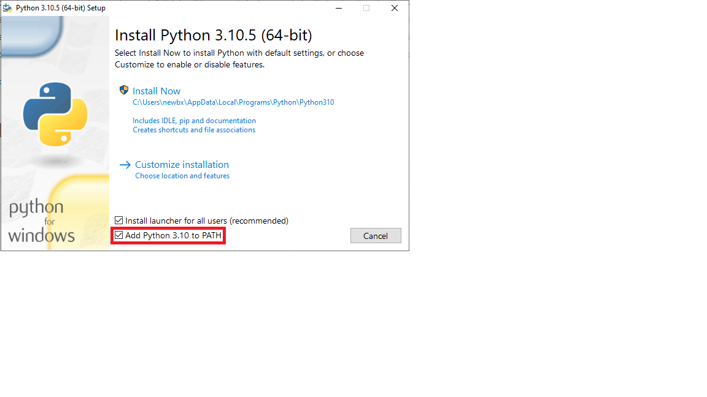 
      <p>NOTE : To verify that Python is inb the PATH, you can open a new terminal, type Python and enter. If you get 
               something like this, it's all good. 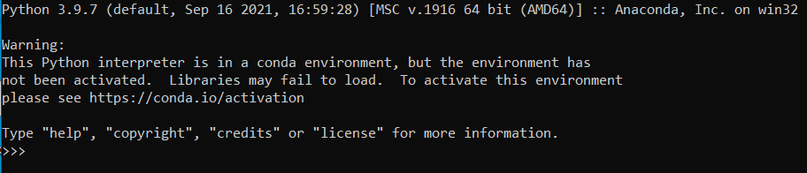
            Otherwise, you have to double-click again on the python.exe file you downloaded at the beginning 
            and click repair. Then click on Next. Then you can click on add to path and install. 
            </p> 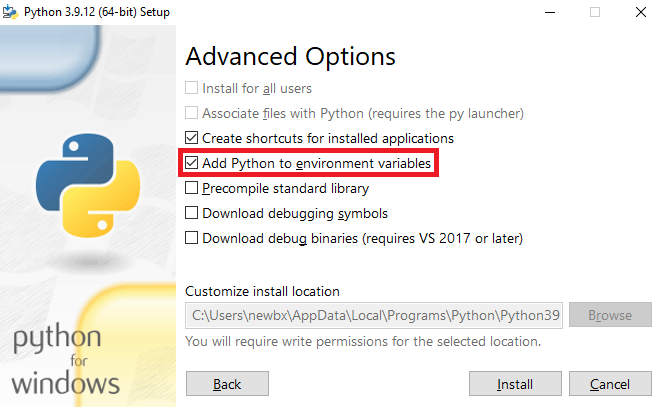 
   </details>
   <details>
      <summary>For Linux &cudarrr;</summary>
      <p>You can select the latest Python source release for python3 or a stable release for 3.8 to 3.10. COMMAND  
      You can also follow this <a href="https://www.scaler.com/topics/python/install-python-on-linux/" target="_blank" rel="noreferrer noopener">tutorial</a> for further details</p>
   </details>
</details>  

<details>
  <summary>Git installation &cudarrr;</summary>
  In order to install Git, you need to go to this <a href="https://git-scm.com/downloads" target="_blank" rel="noreferrer noopener">link</a> and select your operating system. 
   <details>
      <summary>For Windows &cudarrr;</summary>
      <p>You can then choose the Standalone Installer and take the 64 bits one if your computer is less than 10 or 15 years old.
      After downloading the .exe file, double-click on it and follow the installation instructions.</p>
      <p>Note : You'll have a lot of choices, leave them as default if you are not familiar with their implications.</p>
   </details>
   <details>
      <summary>For Linux &cudarrr;</summary>
         Open a terminal and run the command :
            <code>
                sudo apt-get install git
            </code>
         Enter your root password and follow the installation instructions. 
         For more details follows this <a href="https://git-scm.com/download/linux" target="_blank" rel="noreferrer noopener">link</a>.
   </details>
</details>  

<details>
  <summary>Microsoft Visual C++ requirement &cudarrr;</summary>
   To make sure MeDIC and all it's dependencies works properly you need Microsoft Visual C++ 14.0 or later.  
   To check if the correct version of Microsoft Visual C++ is installed or your computer you can open the Control Panel
   from the start menu, click on "uninstall app" and scroll down to see which version, if any, of Microsoft Visual C++ is installed.
   <details>
      <summary>Install new version &cudarrr;</summary>
      <p>In order to install Microsoft Visual C++, you need to go to this 
      <a href="https://visualstudio.microsoft.com/visual-cpp-build-tools/" target="_blank" rel="noreferrer noopener">link</a> and select Visual Studio 2022 Community.</p>
      <p>Select "Desktop development in C++" and go to the "Individual components" tab and scroll down to 
      select "C++ V14.32(17.2) MFC for Build Tools v143 (x86 & x64)" or later and click install (It may take a while depending on your internet download speed).</p>
   </details>
</details>

<div class="accordion" id="accordion_python_installation">
  <div class="accordion-item">
    <h2 class="accordion-header" id="heading_python_installation">
      <button class="accordion-button" type="button" data-bs-toggle="collapse" data-bs-target="#collapse_python_installation" aria-expanded="true"
         aria-controls="collapse_python_installation">
        Python installation
      </button>
    </h2>
    <div id="collapse_python_installation" class="accordion-collapse collapse show" aria-labelledby="heading_python_installation" data-bs-parent="#accordion_python_installation" style="">
      <div class="accordion-body">
         <p>In order to install Python, you need to go to this <a href="https://www.python.org/downloads/" target="_blank" rel="noreferrer noopener">link</a>
         and select your operating system.</p>
         <div class="accordion-item">
             <h2 class="accordion-header" id="headingOne">
               <button class="accordion-button" type="button" data-bs-toggle="collapse" data-bs-target="#collapseOne" aria-expanded="true" aria-controls="collapseOne">
                 For Windows
               </button>
             </h2>
             <div id="collapseOne" class="accordion-collapse collapse show" aria-labelledby="headingOne" data-bs-parent="#accordionExample" style="">
               <div class="accordion-body">
                            <p>You can download the latest version or a previous one if you prefer (Note : MeDIC supports python 3.10, 3.9 and 3.8).  
      You just have to double-click and follow the installation instructions.  
      You can also follow this <a href="https://phoenixnap.com/kb/how-to-install-python-3-windows" target="_blank" rel="noreferrer noopener">tutorial</a> for further details.</p>
      <p>WARNING : Don't forget the select Add Python 3.X to PATH on the first page ! </p> 
      <p>NOTE : To verify that Python is inb the PATH, you can open a new terminal, type Python and enter. If you get 
               something like this, it's all good. 
            Otherwise, you have to double-click again on the python.exe file you downloaded at the beginning 
            and click repair. Then click on Next. Then you can click on add to path and install. 
            </p>  
               </div>
             </div>
           </div>
            <div class="accordion-item">
             <h2 class="accordion-header" id="headingOne">
               <button class="accordion-button" type="button" data-bs-toggle="collapse" data-bs-target="#collapseOne" aria-expanded="true" aria-controls="collapseOne">
                 For Linux
               </button>
             </h2>
             <div id="collapseOne" class="accordion-collapse collapse show" aria-labelledby="headingOne" data-bs-parent="#accordionExample" style="">
               <div class="accordion-body">
                  <p>You can select the latest Python source release for python3 or a stable release for 3.8 to 3.10. COMMAND  
                  You can also follow this <a href="https://www.scaler.com/topics/python/install-python-on-linux/" target="_blank" rel="noreferrer noopener">tutorial</a> for                  further details</p>
               </div>
             </div>
           </div>
      </div>
    </div>
  </div>


  <div class="accordion-item">
    <h2 class="accordion-header" id="headingTwo">
      <button class="accordion-button collapsed" type="button" data-bs-toggle="collapse" data-bs-target="#collapseTwo" aria-expanded="false" aria-controls="collapseTwo">
        Git installation
      </button>
    </h2>
    <div id="collapse_git_installation" class="accordion-collapse collapse" aria-labelledby="headingTwo" data-bs-parent="#accordionExample">
      <div class="accordion-body">
         <div class="accordion" id="accordionExample">
           <div class="accordion-item">
             <h2 class="accordion-header" id="headingOne">
               <button class="accordion-button" type="button" data-bs-toggle="collapse" data-bs-target="#collapseOne" aria-expanded="true" aria-controls="collapseOne">
                 Accordion Item #1
               </button>
             </h2>
             <div id="collapseOne" class="accordion-collapse collapse show" aria-labelledby="headingOne" data-bs-parent="#accordionExample" style="">
               <div class="accordion-body">
                  test intern 1
               </div>
             </div>
           </div>
           <div class="accordion-item">
             <h2 class="accordion-header" id="headingTwo">
               <button class="accordion-button collapsed" type="button" data-bs-toggle="collapse" data-bs-target="#collapseTwo" aria-expanded="false" aria-controls="collapseTwo">
                 Accordion Item #2
               </button>
             </h2>
             <div id="collapseTwo" class="accordion-collapse collapse" aria-labelledby="headingTwo" data-bs-parent="#accordionExample">
               <div class="accordion-body">
                  test intern 2
               </div>
             </div>
           </div>
         </div>
      </div>
    </div>
  </div>
  <div class="accordion-item">
    <h2 class="accordion-header" id="headingThree">
      <button class="accordion-button collapsed" type="button" data-bs-toggle="collapse" data-bs-target="#collapseThree" aria-expanded="false" aria-controls="collapseThree">
        Microsoft Visual C++ requirement
      </button>
    </h2>
    <div id="collapseThree" class="accordion-collapse collapse" aria-labelledby="headingThree" data-bs-parent="#accordionExample">
      <div class="accordion-body">
        test2
      </div>
    </div>
  </div>
</div>

A launcher has been made for MeDIC to facilitate the installation process. 
This launcher can be used for the installation and to start MeDIC.

The launcher file needs Git and Python to be able to do all the installation steps for you.

### A. Normal installation

 - Download launcher.py on our <a href="https://github.com/ElinaFF/MetaboDashboard" target="_blank" rel="noreferrer noopener">github</a>
 - Open a terminal (*cmd* in Windows)
 - Run the launcher on your computer with the command : <a href="#note1">*</a> 
 ```
    python launcher.py
 ```

 <h5 id="note1"> * No need to clone the repository, we will install everything we need. 
If you still want to do so and don’t want the launcher to redownload it during the installation process, make sure to 
clone the repository in the same folder as the launcher.<br> MeDIC uses conda for his environment, 
if you don’t have any Conda instance installed on your machine, the launcher will install one (Miniconda3).
<br> All the dependencies necessary will be installed in the conda environment.</h5>

### B. Clone repository and normal installation
 - Open a terminal (*cmd* in Windows)
 - Clone the Github repository.
  ```
    git clone https://github.com/ElinaFF/MetaboDashboard
  ```
 - Move inside the repository
```
  cd MetaboDashboard
```
 - Run the launcher
```
  python launcher.py
```

### C. Manual installation
 - Install Miniconda following the [documentation](https://docs.conda.io/en/latest/miniconda.html){:target="\_blank"}
 - Open a terminal (**"cmd" in Windows not "Powershell"**)
 - Create an environment with Conda:
```
  conda create medic
```
 - Enter in the environement
```
  conda activate medic 
```
 NOTE: if the command worked, you should see the name "medic" written at the beginning of your prompt as the following image.

 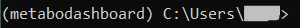

 - Clone the Github repository and move inside.
  ```
    git clone https://github.com/ElinaFF/MetaboDashboard
    cd MetaboDashboard
  ```
 - Install the dependencies:
```
  python -m pip install -r requirements.txt
```
NOTE: if you have an error for ParmEd, pyscm or randomscm, it may be a C++ compilation problem
([see here](https://answers.microsoft.com/en-us/windows/forum/all/microsoft-visual-c-140/6f0726e2-6c32-4719-9fe5-aa68b5ad8e6d){:target="\_blank"})
return [here](#1-installation) to install, or update, Microsoft Visual C++.
 - Launch the Web interface
```
  python main.py
```

### D. Installation on WSL (Windows Subsystem for Linux)
During the normal installation, you may have a problem with the Path variable. We haven't found a solution yet. 
You may need to go through the [Manual installation](#C-manual-installation).

## MeDIC launcher options

Those commands are optionals but may help you to use the launcher in an easier way.  
They can be combined or use independently.

### 1. Use an environment you already have
 - The content of MeDICs environment can be installed in another environment, if you don't want to create a new one, 
with the command : <a href="#note2">**</a> 
  ```
    python launcher.py --environment <environment_name>
    python launcher.py -e <environment_name> 
  ```
  <h5 id="note2"> ** It is recommended not to create MeDIC environment into another environment as it may cause problems.</h5>

### 2. Fast launch for everyday use
 - MeDIC can be launched faster without any verifications of the environment with the command :
  ```
    python launcher.py --no-check
    python launcher.py -c
  ```

### 3. Installing MeDIC for later use
  - MeDIC can be installed without launching it at the end with the command :
  ```
    python launcher.py --no-launch
    python launcher.py -l
  ```

### 4. Update MeDIC to the latest version
  - MeDIC can be updated with the command :  
  ```
    python launcher.py --update
    python launcher.py -u
  ```
  Note: This will verify the environment and download packages if necessary, it also won't start MeDIC.

# 2. Utilization
> [Go back to index](#index)

## Saving file
Before explaining the interface, lets see how the experiments are saved and how you can share them. 
To allow a better modularity of the experiments, the three major steps of MeDIC are saved independently into a file after each step. 
Moreover, the data and metadata are only saved in local repository, not in the saving file, which allow the sharing of 
the file to outside collaborators. 
To continue an experiments and/or visualize its results, MeDIC offers the possibility to load a saving file in the first tab (Home). 
However, to prevent any problem between a local data saving and a potential different saving file, a hashing process 
takes place to compare the file being loaded and the local dumps of data. 

Welcome into MeDIC!

The following sections will resume how to run an experiment and explore each parameter you can set.

>The image in Home tab give a great insight of how the pipeline works.
>
> 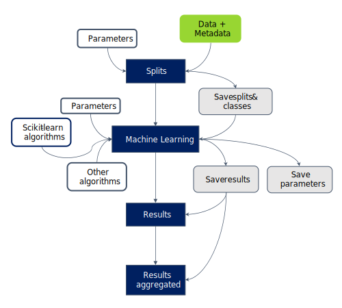

*Pipeline explanation schema in Home tab*

## A. Set the metadata and data
> [Go back to index](#index)

Go to the Splits tab.

> 

*Tab list with the Splits tab opened*

The following instructions are for the ```A) FILES``` section.

If you use Progenesis abundance file, you can choose to use the raw data (instead of the normalized).

To upload the data, drag and drop your data file in the ```DATA FILE(S)``` section.

> 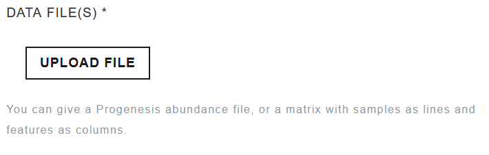
>
> *```DATA FILE(S)``` section*

You can also click on the ```UPLOAD FILE``` button and choose the right file.

**You can repeat the operation for the metadata in the ```METADATA FILE``` section.**

> 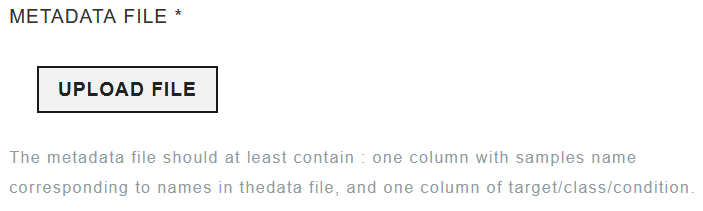
>
> *```MEATADATA FILE``` section*


The supported files are excel, odt or csv.

If the error "<span style="color: red">Rows must have an equal number of columns</span>" occurred, it means that 
some lines don't have cells for all columns.

## B. Split parameters
> [Go back to index](#index)

### 1. Define Experimental designs
> [Go back to index](#index)

The following instructions are for the ```B) DEFINE EXPERIMENTAL DESIGNS``` section.

With the board, you can run multiple experimental design, under certain conditions. These conditions are:
- use the same split parameters
- use the same Machine Learning (ML) algorithms
- use the same ML parameters

First, you need to select the target column. To clarify, the target column contains the values that the algorithms 
will try to predict. A typical example is the column that contain the diagnosis.

The columns name prompted in the following figure are the column in the metadata file previously uploaded. If there 
are not the ones expected, please retry uploading the metadata in [this section](index.md#a-set-the-metadata-and-data)

> 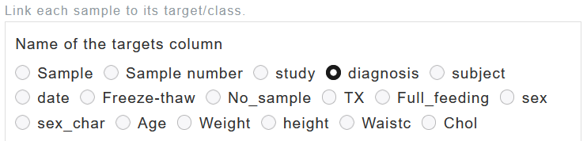
>
> *Targets column selection panel*

After setting the target column, we need to set the samples' column. This column has to contain **unique IDs** for each sample.

> 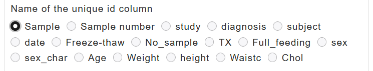
>
> *Samples column selection panel*

The main part of the experimental designs configuration section is divided in two panel, respectively the *repository* 
and the *configuration* panel

Once the target columns are defined, the possible labels are updated in the *configuration* panel as shown in the 
following figure.

> 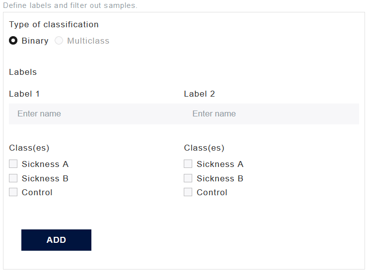
> 
> *Updated possible labels in the* configuration *panel*

To build a binary design, you need to define the classes, in other words, to choose what you want to be opposed. 
An example using the previous values could be the identification of the sick person, opposing persons tagged with 
"Sickness A" and "Sickness B" and persons tagged "Control".

Add the experimental design by clicking on the ```ADD``` button.

> 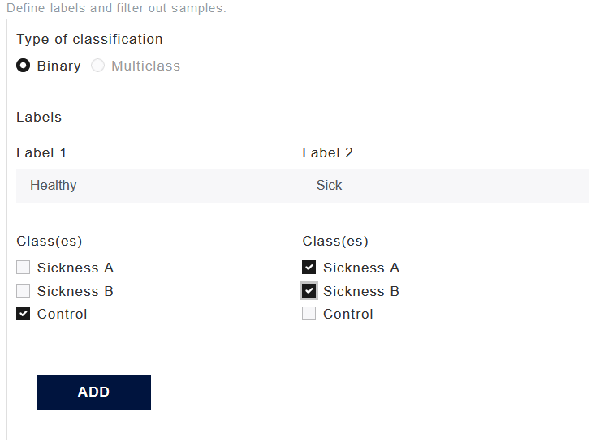
>
> *Example of a experimental design*

Note that you need to set a name, a label, for each class. Also, you need to set at least one possible target per 
class, but you don't need to assign all possible targets.

Once the designs are created, they will appear in the *repository* panel.

> 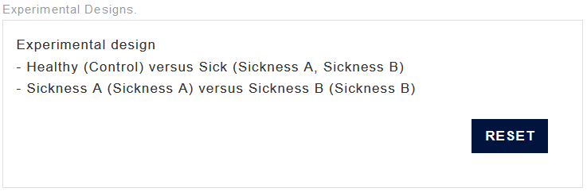
>
> Repository *panel with two experimental design*

The ```RESET``` button will delete all the designs.

### 2. Data fusion
> [Go back to index](#index)

> **Warning**
> Not implemented yet


```Pos and Neg pairing``` allows to prevent the separation of positive and negative ionization and prevent the ML 
algorithms to learn the link between positive and negative ionization.

You can also use any other pattern for pairing with ```Other pairing```.

### 3. Define split
> [Go back to index](#index)

The following instructions are for the ```D) DEFINE SPLITS``` section.

> 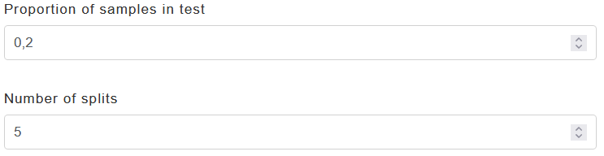
>
> *```DEFINE SPLITS``` splits section*

If you don't feel conformable with these parameters, the minimum you need to know is:
- the proportion is quite standard, it will suit most of the time
- 5 splits is quick to run but some samples may never be used to test the algorithms. A more complete run will take 15 to 25 splits.

In the other case, the splits are made by copying the dataset and applying a random separation with a different 
random seed at each time. This principle is called bootstrap.

Most of the time, medical data are fat data ,i.e. contains many features (characteristic) for few samples, 
which can lead to many large when the training set is changed.

Moreover, as the cross validation (explained in further details in section [2.C.1](#1-define-learning-configurations)), 
it allows the model(s) to be tested on most of the samples.

If you want to achieve it, the probability that all samples are seen in the test set, i.e. the 
probability that a sample is never in the test set, follow a 
<a href="https://en.wikipedia.org/wiki/Markov_chain" target="_blank" rel="noreferrer noopener">Markov chain</a>. With an
example of 5 samples with 80-20 train-test repartition, the chain is as follows:
- The initial state $$V_1=\begin{pmatrix} 0 & 1 & 0 & 0 & 0 \end{pmatrix}$$
- $$P(s_{t+1}=j\|s_t=i)=\frac{\begin{pmatrix} m-i \\ j-i \end{pmatrix}\begin{pmatrix} i \\ k-(j-i) \end{pmatrix}}{\begin{pmatrix} m \\ k \end{pmatrix}}$$ with $$s_t$$ a state at a $$t$$ moment, $$m$$ the total number of samples and $$k$$ the number of samples in the test set (test proportion$$\times m$$).
- $$M$$ the $$5\times 5$$ matrix of $$P(s_{t+1}=j\|s_t=i)$$
- $$V_n=V_1\times M^{n-1}$$ with $$n$$ the number of splits- $$P(X \gt 1) = 1-V_n[5]$$ where $$X$$ is a random variable
- that model the number of samples that are never in the test set

The figure hereunder shows $$P(X \gt 1)$$ (values) as a function of the number 
of splits $$n$$ (1:nbr_limit) with $$m=250$$ samples and a test proportion of $$0.2$$ ($$k=50$$)


> 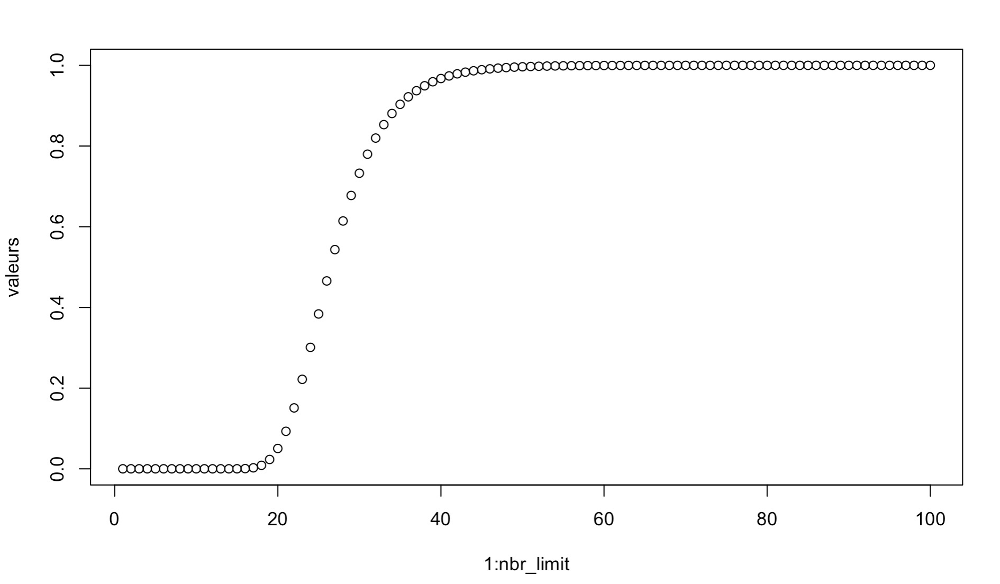
>
> *$$P(X \gt 1)$$ (valeurs) as a function of the number of splits $$n$$ (1:nbr_limit) 
> with $$m=250$$ samples and a test proportion of  $$0.2$$ ($$k=50$$)*

### 4. Other preprocessing
> [Go back to index](#index)

> **Warning**
> Not implemented yet

This section is for LDTD support.

You can show all the processing parameter by clicking on the ```OPEN``` button.


### 5. Generate file
> [Go back to index](#index)

These finals instructions are for the ```F) GENERATE FILE``` section.

Once all the parameters, the samples id and target columns, and **at least one** experimental design are set, you can
run the splits' computation by clicking on the ```CREATE``` button.

> 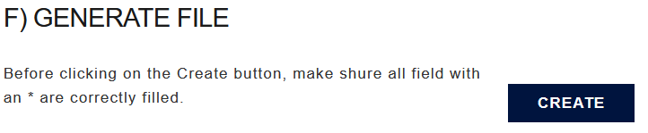
>
> *```GENERATE FILE``` section*

## C. Machine Learning parameters
> [Go back to index](#index)

### 1. Define learning configurations
> [Go back to index](#index)

The following instructions are for the ```DEFINE LEARNING CONFIGS``` section.

If you're not comfortable with these parameters, you can safely keep the default 
values and jump to the [next section](#2-define-learning-algorithms).

First, before choosing a Cross Validation (CV) search type, you need to understand 
the principle of CV.

The method consist in separating the dataset in $$n$$ sections. At each iteration, 
the first or the next section will be used as the test set and the other sections will 
form the training set. It allows us to train **and** test the model on all the dataset. 
Furthermore, the mean accuracy over the folds is a better measurement of the performance of the models.

The number of folds defines the number of time the model(s) will be trained, and the number 
of division in the dataset.

We use CV in order to make sure the model doesn't overfit, 
we keep a sample of the dataset to test it at the end. If the algorithm is overfitting,
it will make a lot of errors when presented a new set of data. This also allows us to 
make sure the algorithm is tested on all samples.

For more details, see this [explanation](https://learn.g2.com/cross-validation).

The ability of a search algorithm is to train a set of models with a set of parameters, 
and compute a metric tested combination. This metric is most of the time the accuracy 
(the number of correct predictions over the total number of predictions (the number of samples)).

After the computation, the algorithm is able to find the model combined with the parameters 
that perform best, in the tested combinations.

The ```GridSearchCV``` is a search algorithm using CV that test every possible 
combination of parameters, like in a grid. This method is effective but may take a long time 
to run and may test useless combination.

The ```RandomizedSearchCV``` comes as a counterpoint and take random combinations of parameters. This method allow 
more values to be tested and runs faster but isn't as rigorous as the ```GridSearchCV```.  

In the ```SELECT CV SEARCH TYPE``` panel, you can choose either ```GridSearchCV``` or ```RandomizedSearchCV```.

You can set the number of folds in the ```NUMBER OF CROSS VALIDATION FOLDS```.

The number of processes in the ```Number of processes``` field is the number of parallel job you want to run. Two is enough 
to increase the speed of computation. More processes might slow down to crash your PC.

### 2. Define learning algorithms
> [Go back to index](#index)

The following instructions are for the ```DEFINE LEARNING ALGORITHMS``` section.

The ```AVAILABLE ALGORITHMS``` are:
- Decision Tree
- Random Forest
- SCM
- Random SCM

The first classifier implement a regular ***decision tree***. To make a prediction, the data is the input of the root node.
The root node, as the others, has a threshold for one feature : for example $$\text{cholesterol} \geq 2$$.
If the value validate the threshold, it goes to the right node, otherwise it goes to the left, until it reach a leaf.
The leaf assigns a class to the sample.

The second classifier, the ***random forest***, is a decision tree (DT) ensemble that classify independently the sample. 
Each DT vote the class of the sample. The class that has the most vote is assign to the sample.

The ***Set Covering Machine (SCM)*** is a combination of rules. For example, if the cholesterol is greater than 2 g/l OR insulin is 
greater than 140 mg/dL AND insulin is less than 199 mg/dL.

The last classifier is the ***Random SCM***. As the random forest is a voting decision tree ensemble, the random SCM is a voting SCM ensemble.

You have to tick **at least one** algorithms. 

But because of their differences, some may perform better than others on different datasets. 
It is advised to take at least one SCM-type and one DecisionTree-type algorithms.

If you want to add [scikit-learn algorithms](https://scikit-learn.org/stable/index.html) that isn't in the available algorithms, you can in the ```ADD SKLEARN ALGORITHMS```.

You need to complete the import and specify the grid search parameter (for the CV search algorithm). 

<details>
<summary>Add a full custom algorithms (for expert) &cudarrr;</summary>

To add a full custom model, you need to add it to the configuration file located at <code class="language-plaintext highlighter-rouge">metabodashboard/conf/SupportedModel.py</code>.  

Add a dictionary containing the <strong>NON-INSTANTIATED</strong> class and the param grid. Format is the following (change only the attribute _xxx_)

<pre>
  <code class="language-python">
    "_Printed_name_": {
          "function": _non-instantiated_class_,
          "ParamGrid": {
              "_p1_": _[0.5, 1., 2.]_,
              "_p2_": _[1, 2, 3, 4, 5]_,
              ...
          }
      },
  </code> 
</pre>

After adding your configuration, <strong>reboot</strong> MeDIC by stopping and restarting the launcher.  

The algorithm should be in the <code class="language-plaintext highlighter-rouge">AVAILABLE ALGORITHMS</code> section with his printed name.  

Note, the custom model are in the save file (.mtxp) and will be restored.  

</details>

## D. Look at the results for each algorithm
> [Go back to index](#index)

## E. Compare algorithms results
> [Go back to index](#index)

## F. Restore previous experiment
> [Go back to index](#index)

# 3. Implementation
> [Go back to index](#index)

## A. Architecture
> [Go back to index](#index)

MeDIC software is organized in three main package.
 - The Domain package :  
 It contains all the logic that compose MeDIC.  
 This package can access freely the Service package.  
 All the communication with the UI package must pass by the controller. This allows us to modify the Domain if necessary without having to modify the UI too.
 - The User Interface (UI) package :  
 It contains all the classes that are used to display the web interface of MeDIC.  
 It manages only the interface and connects to the Domain by the controller only.
 - The Service package :  
 It can be accessed by both other packages and contains methods that are frequently used in different classes.

Here is a diagram that represents the communications between all three packages. 

> 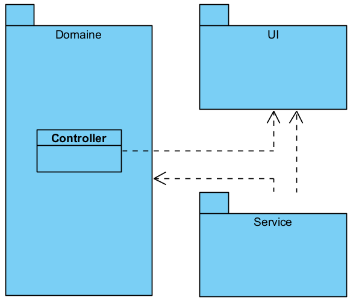
>
> Package diagram

This diagram shows all the classes that compose the Domain package of MeDIC and the interaction between them.

> 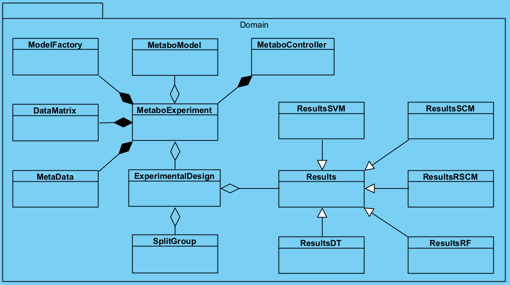
>
> Simplified class diagram of the Domain package

This diagram shows all the classes that compose the UI package of MeDIC and the interaction between them.

> 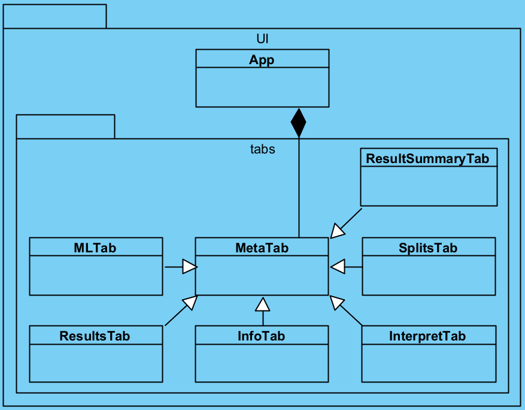
>
> Simplified class diagram of the UI package

## B. Controller interface
> [Go back to index](#index)

This section can be use as a high-level documentation of the MetaboController class that serves of controller in MeDIC.

This class can be used to integrate MeDIC in a Python script.

The explanation of the concepts and the pipelines are in the ["2. Utilization"](#2-utilization) section. Don't hesitate to go back to this section while reading this one.

```Python
  set_metadata(filename: str, data=None, from_base64=True)
```
This function sets the metadata using the path specified in parameter.
The from_base64 parameter must be set to false if your file isn't encoded (csv, xlsx, ...).


```Python
  set_data_matrix_from_path(path_data_matrix, data=None, use_raw=False, from_base64=True)
```
This function sets the data matrix the same way as the metadata.


```Python
  set_id_column(id_column: str)
```
This function sets the name of the column containing the **unique** IDs.

```Python
  set_target_column(target_column: str)
```
This function sets the name of the column containing the targets.

```Python
  add_experimental_design(classes_design: dict)
```
This function adds an experimental design. The input dictionary must follow the format : 
```Python
  {
    "class1": ["target1", "target2"],
    "class2": ["target3"]
  }
```

```Python
  set_train_test_proportion(train_test_proportion: float)
```
This function sets the proportion of the data that will be used as tests after the training.

```Python
  set_number_of_splits(number_of_splits: int)
```
This function sets the number of splits as explain in ["Define split"](#3-define-split)

```Python
  create_splits()
```
Once all the splits are set, this function creates all the splits at the same time.

```Python
  set_selected_models(selected_models: list)
```
Set the list of models that will be trained.

```Python
  learn(folds: int)
```
Start the training of all the models on all splits.
Folds is used for the cross-validation process (explained in [Define learning configuration](#1-define-learning-configurations))

```Python
  get_all_results()
```
Return all the data about the results, and the best model.

## C. Full class diagram

> [Go back to index](#index)

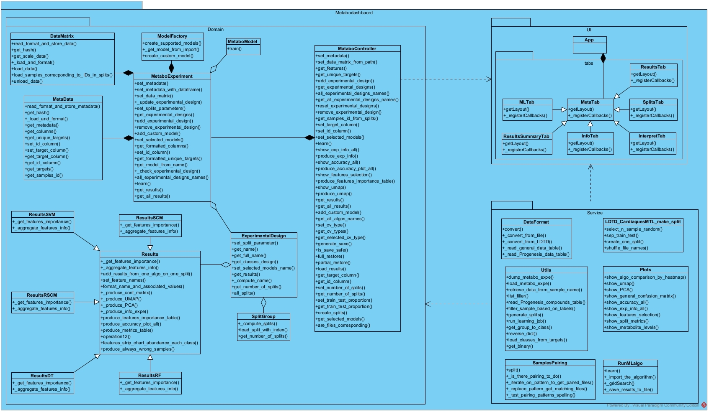


